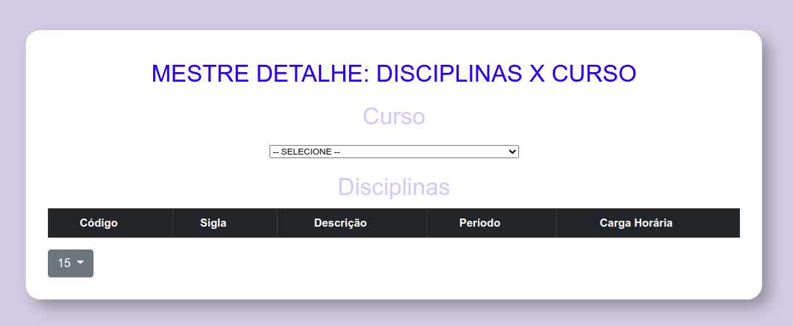
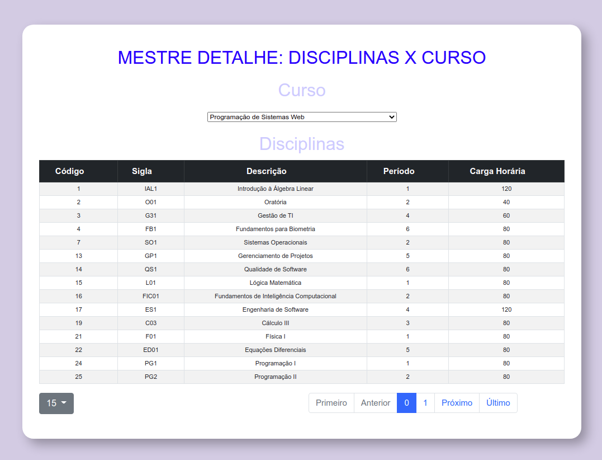
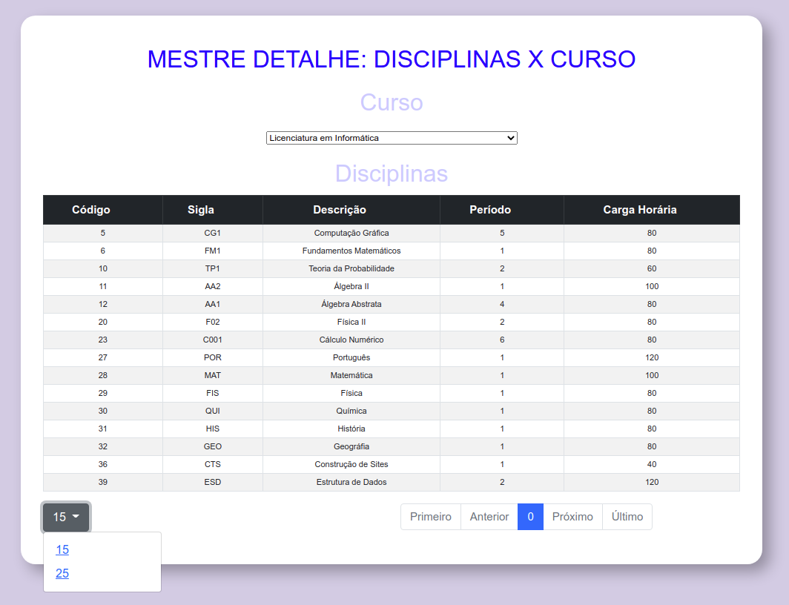

# Exercício acerca de esquema mestre detalhe de dados

Esse exercício deve considerar o clone do código público disponibilizado no repositório [alexpaulooliveira/reactjs_exerc__master_detail___start_point](https://github.com/alexpaulooliveira/reactjs_exerc__master_detail___start_point) como ponto de partida. 

### Como baixar, configurar, e executar a aplicação:

Estando na pasta à partir da qual você deseja que a aplicação seja criada, execute o seguinte comando:

```
git clone <endereço do repositório>
```

Depois, instale as bibliotecas listadas no package.json, fazendo uso do seguinte comando:

```
npm install
```

Por fim, execute a aplicação fazendo uso do seguinte comando:


```
npm start
```

## Objetivos do exercício:

### 1) Ajustar o *backend* (*API REST*) acrescentando um método que receba o código do curso (na própria URL) e retorne um *JSON* com todas as disciplinas que estão vinculadas ao curso parametrizado.

Considere o *ERD* visto na imagem abaixo para programar a *API REST* que atenderá às necessidades do exercício em pauta:


### 2) Crie um combo que carregue a lista de todos os cursos que existem na base de dados. A primeira opção do combo será acrescentada manualmente, e será o texto "-- SELECIONE --". As demais opções deverão ser carregadas por meio da *API REST*, ajustada na questão anterior. Enquanto nenhum curso for selecionado, o sistema deve se comportar de maneira similar à que pode ser visualizada no *screen shot* abaixo:




### 3) O combo criado na questão anterior representa o seletor do *registro mestre*. Quando um curso for selecionado, suas disciplinas (*registros detalhe*) devem ser listadas em um grid, conforme imagem seguinte:




### 4) Configure o grid para possibilitar duas opções de paginação (com 15 e com 25 registros), conforme visualizado na imagem seguinte:

